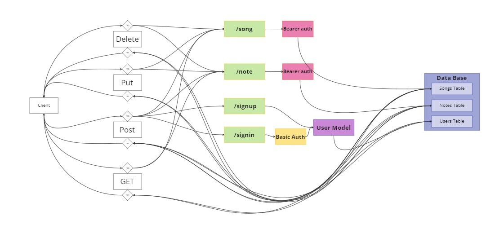

# LAB - Class 09

## Project: Auth Practice

### Authors: Joe Davitt and Martin Hansen

### Problem Domain

Allow user to keep a database of notes and favorite songs

### Links and Resources

- [render](https://lab-09.onrender.com/)

### Setup

#### `.env` requirements (where applicable)

DATABASE_URL=postgres://localhost:5432/lab09

#### How to initialize/run your application (where applicable)

- e.g. `npm start`

#### UML

